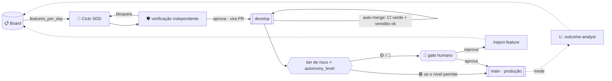
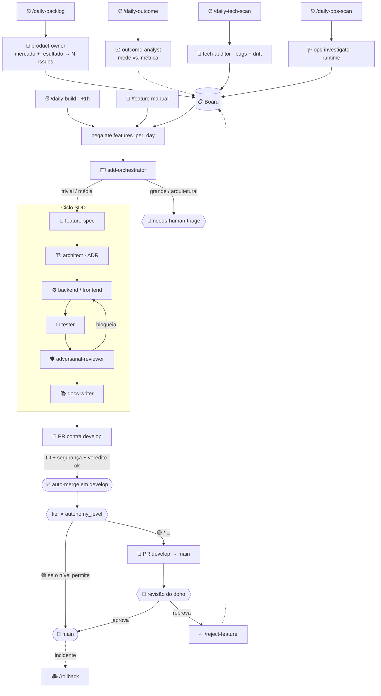

<div align="center">

# 🤖 ai-first

**Um método reutilizável para delegar o desenvolvimento de um produto a agentes de IA — com governança, verificação independente e autonomia ajustável.**

*SDD + context mesh + ADRs + roster de subagentes + skills que dirigem o fluxo do backlog à produção. Mais liberal que "vibe coding", mais seguro que soltar a IA no repositório: você define o contexto **uma vez** (a gênese) e depois o organismo cresce sozinho — o humano só decide, no fim do dia, **o que nasce em produção**.*

</div>

---

## 📚 Sumário

- [O que é (e o que não é)](#-o-que-é-e-o-que-não-é)
- [A vida em duas fases: gênese → organismo](#-a-vida-em-duas-fases-gênese--organismo)
- [A ideia central: autonomia progressiva por risco](#-a-ideia-central-autonomia-progressiva-por-risco)
- [Os sete pilares](#-os-sete-pilares)
- [O fluxo ponta a ponta](#-o-fluxo-ponta-a-ponta)
- [O ciclo SDD (por feature)](#-o-ciclo-sdd-por-feature)
- [O roster de subagentes](#-o-roster-de-subagentes)
- [As skills (o que dispara o quê)](#-as-skills-o-que-dispara-o-quê)
- [Governança e retroalimentação](#-governança-e-retroalimentação)
- [Os knobs ajustáveis (cadência, autonomia, orçamento)](#-os-knobs-ajustáveis-cadência-autonomia-orçamento)
- [As rotinas autônomas](#-as-rotinas-autônomas)
- [Estrutura do repositório](#-estrutura-do-repositório)
- [Como adotar em um projeto](#-como-adotar-em-um-projeto)
- [FAQ](#-faq)

---

## 🎯 O que é (e o que não é)

`ai-first` é um **kit de método** — arquivos de processo, não uma biblioteca. Você o copia para um
projeto e ganha um jeito **disciplinado e majoritariamente autônomo** de a IA evoluir o produto: do
levantamento de backlog ao código em produção, com rastreabilidade, invariantes garantidas,
verificação independente e gates automáticos.

|  | Vibe coding | **`ai-first`** | SDD manual |
|---|---|---|---|
| Especificação antes do código | ❌ | ✅ (rastreável) | ✅ |
| Invariantes garantidas | ❌ | ✅ (constituição + testes) | ✅ |
| Verificação independente do código | ❌ | ✅ (`adversarial-reviewer`) | 〜 |
| Loop fechado com resultado real | ❌ | ✅ (`outcome-analyst`) | ❌ |
| Velocidade de automação | ✅ | ✅ | ❌ (humano em todo passo) |
| Gate humano | nenhum | **por risco, ajustável** | vários |

Ele **não** é: um framework de aplicação, uma dependência de runtime, ou algo acoplado a uma stack,
cloud, arquitetura, infraestrutura ou contexto de produto. O framework nasce **agnóstico**: os
subagentes e skills não sabem nada do seu mundo até a **gênese** — a skill primária `/ai-first-init`
entrevista o humano e grava o contexto no **genoma** (`docs/ai-first/project.md`) e nos arquivos
canônicos. A partir daí, o roster passa a falar a língua do seu domínio sem que você edite um agente
sequer.

## 🧬 A vida em duas fases: gênese → organismo

```
FASE 0 — GÊNESE (uma vez, com o humano)          FASE 1 — ORGANISMO AUTÔNOMO (cresce sozinho)
──────────────────────────────────────          ─────────────────────────────────────────────────
/ai-first-init entrevista o humano:              backlog → build → verificação independente →
stack · cloud · arquitetura · infra ·     ──▶    develop → promoção POR RISCO; saúde e RESULTADO
produto · invariantes · qualidade ·              auditados. O humano decide, no fim do dia, o que
CADÊNCIA · AUTONOMIA · orçamento →                nasce em produção — e ajusta os knobs quando quiser.
grava o genoma e arma o organismo.               O processo é fixo; o ritmo e a autonomia são dele.
```

**Você define o contexto uma vez** e depois **só decide o que chega à produção**. Nada de conduzir
cada passo — o organismo cresce; o humano é o batimento cardíaco (aprova/reprova) e o dono dos knobs.

## 🔑 A ideia central: autonomia progressiva por risco

O objetivo é ser **mais liberal que o vibe code** sem abrir mão de controle. A automação: **descobre**
o que fazer (Product Owner com benchmarking de mercado **e** o resultado real das features passadas) →
**implementa** pelo ciclo SDD → **verifica de forma independente** (um agente que não escreveu o
código tenta quebrá-lo e dirige o runtime) → **auto-mergeia em `develop`** (só com CI verde + veredito
não-bloqueante) → **promove `develop → main` por tier de risco**.

O gate humano **não é fixo — é um dial** (`autonomy_level`, definido na gênese, ajustável a qualquer
momento):

- **Conservador (default):** o humano aprova **tudo** — o gate único diário clássico.
- **Progressivo:** 🟢 baixo impacto/risco promove sozinha; 🟡/🔴 sobem ao humano.
- **Amplo:** 🟢 e 🟡 promovem sozinhas (com amostragem de auditoria); 🔴 **sempre** sobe.

O humano nunca some — ele passa de "aprova cada uma" para "decide as arriscadas e audita as verdes". O
nível sobe **com o histórico** (baixa taxa de rejeição/rollback), nunca por pressa.



## 🧱 Os sete pilares

1. **SDD (Spec-Driven Development)** — toda mudança de comportamento começa por uma spec verificável
   e termina atualizando-a. `docs/sdd/`.
2. **Constituição** — princípios inegociáveis (P-1…P-15 universais + Parte B do projeto). Violar um é
   bug arquitetural, mesmo com testes verdes. `docs/sdd/constitution.md`.
3. **Context mesh leve** — um mapa determinístico (domínio → código+docs+ADRs+testes) que faz cada
   agente carregar **só** a fatia que a tarefa pede. `docs/context-map.md`.
4. **Verificação independente (P-11)** — quem escreve ≠ quem aprova: o `adversarial-reviewer` tenta
   **quebrar** cada feature e dirige o runtime real; veredito pode **bloquear o merge**. CI verde não
   basta.
5. **Loop fechado com a realidade (P-12)** — toda feature declara uma métrica de sucesso e é **medida
   pós-ship** (`outcome-analyst`); o que não moveu o ponteiro é iterado ou removido.
6. **Retroalimentação** — **ADRs** (o *porquê* das decisões duráveis) + **ledger de rejeições** (os
   "nãos" do dono) + **resultado real** fazem cada aposta decidir à luz das anteriores.
7. **Roster de subagentes + skills** — papéis especializados mapeados às fases, e skills que os
   orquestram (a gênese, uma feature, as rotinas). `.claude/`.

## 🔄 O fluxo ponta a ponta



## 📐 O ciclo SDD (por feature)

Cada feature é uma **fatia vertical** rastreada numa pasta `docs/sdd/features/NNN-slug/`,
atravessando os módulos necessários — sem reorganizar o código por feature.

| Fase | Artefato | Quem |
|---|---|---|
| 1 · **SPECIFY** | `spec.md` (o quê/porquê, RFs, aceite, **métrica de sucesso §8**, gate constitucional) | `feature-spec` |
| 2 · **PLAN** | `plan.md` (design, dados, idempotência, riscos) + `tasks.md` + ADR se durável | `architect` |
| 2½ · **DECOMPOSE** *(só se grande)* | quebra em **micro-slices** isoladas (contexto estreito, árvore verde) + slice de integração | `task-decomposer` |
| 4 · **IMPLEMENT** | código na branch `claude/<slug>` — **slice a slice, cada uma em contexto isolado** | `backend`/`frontend-engineer` |
| 4¾ · **ACCEPTANCE (BDD)** *(se `bdd_style ≠ off`)* | critérios de aceite → **cenários executáveis** (o oráculo) | `bdd-author` |
| 5 · **VERIFY** | liga os cenários ao runner + testes por slice + integração; gate verde | `tester` |
| 5½ · **VERIFY (independente)** | tenta quebrar + dirige runtime; **pode bloquear o merge** | `adversarial-reviewer` |
| 6 · **DOCS** | spec e docs refletem o **entregue** | `docs-writer` |
| ↻ · **OUTCOME** | mede pós-ship se a métrica de sucesso foi atingida | `outcome-analyst` |

> **Gate constitucional:** a spec não pode violar a constituição. Se precisar, a **primeira** mudança
> é um PR na própria constituição. Ver [`docs/sdd/README.md`](docs/sdd/README.md).

## 👥 O roster de subagentes

Papéis especializados em `.claude/agents/` — cada um carrega, pré-compilado, o subconjunto de
convenções da sua fase, para o thread principal delegar com **escopo curto**. Detalhes em
[`.claude/agents/README.md`](.claude/agents/README.md).

| Subagente | Papel |
|---|---|
| `product-owner` | Propõe features (mercado + resultado real) e cria issues |
| `tech-auditor` | Varre bugs, débito **e drift arquitetural** → issues (não corrige) |
| `ops-investigator` | Varre métricas/logs/DLQ → issues com sugestão (não corrige) |
| `sdd-orchestrator` | Classifica o tamanho e **roteia modelo+esforço por etapa** (custo-benefício); tag na issue. **Único de modelo fixo (opus/alto)** |
| `feature-spec` | Escreve a spec (o quê/porquê + métrica de sucesso) |
| `architect` | Desenha o plano técnico + tasks + ADR |
| **`task-decomposer`** | Quebra feature grande em **micro-slices** isoladas + integração (contexto estreito, árvore verde) |
| `ux-designer` | Brief de UI/UX (só em UI significativa) |
| `backend-engineer` | Implementa o código de produção |
| `frontend-engineer` | Implementa a interface |
| **`bdd-author`** | Converte os critérios de aceite em **cenários BDD executáveis** (o oráculo) — se `bdd_style ≠ off` |
| `tester` | Liga os cenários ao runner + testes/evals; deixa o gate verde |
| **`adversarial-reviewer`** | **Verificação independente** — tenta quebrar; dirige runtime; **bloqueia o merge** |
| `docs-writer` | Reflete o comportamento final nos docs |
| **`outcome-analyst`** | **Mede o resultado real** pós-ship vs. a métrica declarada |

> Um subagente **não** invoca outro — quem encadeia é o thread principal (a skill). **Separação de
> papéis (P-13):** quem escreve não é quem verifica nem quem aprova o risco.
>
> **Modelo e esforço são roteados, não fixos:** o `sdd-orchestrator` decide por custo-benefício qual
> modelo (`haiku`/`sonnet`/`opus`/`fable`) e esforço (`baixo`/`médio`/`alto`/`extra`) cada etapa usa,
> aplica a tag na issue, e é o **único** subagente pinado (opus/alto) — para não errar o roteamento.
> Segurança e invariantes nunca abaixo de opus/alto.

## 🛠 As skills (o que dispara o quê)

| Skill | O que faz | Disparo |
|---|---|---|
| **`/ai-first-init`** | **A gênese** — entrevista o humano e define stack/cloud/arquitetura/infra/produto + os knobs. Roda **uma vez** (revisa depois) | Humano (setup) |
| `/feature <n>` | Leva **uma issue** ao PR pelo ciclo SDD (com gates após spec e plan) | Humano |
| `/reject-feature <n>` | Reverte de `develop` uma feature reprovada, reabre a issue, registra o motivo | Humano |
| `/rollback <n>` | **Incidente em produção** — kill-switch/revert em `main` com segurança | Humano/alerta |
| `/daily-backlog` | Cria `features_per_day` issues de negócio (PO + benchmarking + resultado) | Cron |
| `/daily-build` | Implementa até `features_per_day`, verifica, auto-mergeia, promove por risco | Cron (+1h) |
| `/daily-tech-scan` | Varre **código** (bugs/débito/drift) → issues fora do fluxo autônomo | Cron |
| `/daily-ops-scan` | Varre **runtime** (métricas/DLQ) → issues fora do fluxo autônomo | Cron |
| `/daily-outcome` | Mede se as features **entregaram resultado** → alimenta o PO | Cron (semanal) |
| `/new-extension` | Scaffold de um novo ponto de extensão pelo mecanismo do projeto | Sob demanda |

## 🏛 Governança e retroalimentação

O que faz cada feature decidir **à luz das anteriores**, em vez de do zero:

- **Constituição** ([`docs/sdd/constitution.md`](docs/sdd/constitution.md)) — princípios inegociáveis.
  Parte A universal P-1…P-15 (processo, verificação, autonomia, segurança, economia); Parte B do projeto.
- **ADRs** ([`docs/adr/`](docs/adr/)) — cada decisão arquitetural durável. O `architect` lê o índice
  antes de decidir e escreve o ADR; ninguém re-litiga uma decisão viva em silêncio.
- **Ledger de rejeições** ([`docs/product/rejections.md`](docs/product/rejections.md)) — todo "não" do
  dono vira aprendizado, para o `product-owner` não repropor a mesma coisa.
- **Resultado real** (`outcome-analyst`) — o uso mostra o que funcionou; o PO dobra no que deu certo e
  itera/para no que não deu. É a retroalimentação mais valiosa e a mais esquecida em automação.

## 🎛 Os knobs ajustáveis (cadência, autonomia, orçamento)

Definidos na gênese, gravados no genoma (`docs/ai-first/project.md §8`), **mudáveis a qualquer momento**
(P-15):

- **`features_per_day`** — quantas features o PO cria e o build implementa por rodada (comece em 1, suba
  com confiança). **É a variável que escala o organismo.**
- **`autonomy_level`** — `conservador` | `progressivo` | `amplo` (quem promove sozinho, por tier de risco).
- **`daily_budget`** — teto de gasto/esforço do loop por período (P-14).
- **Modelo fixado** — upgrade é decisão explícita, com re-baseline de evals (P-14).

Para mudar: edite o genoma ou rode `/ai-first-init` em modo revisão. Vale já no próximo ciclo.

## ⏰ As rotinas autônomas

```
/daily-backlog   → PO cria features_per_day issues (mercado + resultado real)
   … ~1h (assenta) …
/daily-build     → implementa → verifica (independente) → develop → promove por risco → resumo ao dono
/daily-tech-scan → tech-auditor: bugs + débito + drift arquitetural (needs-human-triage)
/daily-ops-scan  → ops-investigator: métricas/DLQ do runtime (needs-human-triage)
/daily-outcome   → outcome-analyst: as features moveram o ponteiro? (alimenta o PO)
```

- **Espace os crons pesados** por várias horas para não competirem por orçamento na mesma janela.
- **Toda rotina avisa em falha** (push + e-mail): nunca termina em silêncio; sempre com a frase de retry.
- **`/daily-build` é checagem cruzada** do `/daily-backlog`: backlog vazio → alerta.

## 📁 Estrutura do repositório

```
ai-first/
├── README.md                      · este arquivo
├── CLAUDE.md                      · índice-mãe (mapa de módulos + invariantes) — preenchido na gênese
├── .claude/
│   ├── agents/                    · o roster (15 subagentes + README)
│   └── skills/                    · ai-first-init, feature, reject-feature, rollback, daily-*, new-extension
├── docs/
│   ├── ai-first/project.md        · 🧬 o GENOMA — contexto + knobs do projeto (preenchido na gênese)
│   ├── sdd/
│   │   ├── constitution.md        · P-1…P-15 universais + Parte B do projeto
│   │   ├── README.md              · o ciclo SDD
│   │   ├── specification.md       · RFs vivos (esqueleto)
│   │   ├── technical-plan.md      · RNFs / arquitetura macro (esqueleto)
│   │   ├── tasks.md               · backlog vivo (esqueleto)
│   │   ├── templates/             · spec / plan / tasks
│   │   └── features/              · uma pasta NNN-slug por feature (com um exemplo)
│   ├── adr/                       · README (índice) + template + ADR-0001 (adoção do método)
│   ├── context-map.md             · o context mesh leve
│   └── product/rejections.md      · ledger de rejeições
└── .github/
    ├── pull_request_template.md   · checklist + gate constitucional
    ├── ISSUE_TEMPLATE.md          · com as labels que o fluxo autônomo usa
    └── workflows/ci.yml           · required checks (qualidade + segurança)
```

## 🚀 Como adotar em um projeto

1. **Copie** `.claude/`, `docs/` e `.github/` para o seu repositório (e o `CLAUDE.md`).
2. **Rode a gênese: `/ai-first-init`.** É a **única fase densa com o humano** — ela entrevista você
   sobre stack, cloud, arquitetura, infra, produto, invariantes, qualidade e os **knobs** (cadência,
   autonomia, orçamento), e preenche o genoma + constituição Parte B + `CLAUDE.md` + `context-map.md` +
   `ci.yml`. Sem isto, o framework é só um esqueleto agnóstico.
3. **Adapte o gate:** confirme que `ci.yml` usa os comandos do seu ecossistema (qualidade + segurança)
   e marque `ci`, o gate de segurança e o `adversarial-reviewer` como **required checks** em branch
   protection para `develop` e `main`. Crie a branch `develop`.
4. **Ajuste o mecanismo de extensão:** reescreva `.claude/skills/new-extension` com os contratos reais
   do projeto (ou crie irmãs — `new-provider`, `new-action`).
5. **Agende os crons** (backlog → build → outcome/scans), espaçados, com push + e-mail habilitados.
6. **Comece conservador:** `features_per_day: 1`, `autonomy_level: conservador`. Suba os dois **com o
   histórico** — quanto menor a taxa de rejeição/rollback, mais autonomia o organismo merece.

## ❓ FAQ

**Isto substitui o programador?** Não. Substitui o *trabalho mecânico* de conduzir o ciclo. O humano
define o contexto, decide o que vai para produção e resolve o que a automação marca como
`needs-human-triage` (mudanças grandes/arquiteturais, que **nunca** são auto-implementadas).

**Como isso escala?** Pelo `features_per_day` (mais features/rodada) e pelo `autonomy_level` (menos
coisas passando pela sua mão). Ambos são dials que você sobe conforme a confiança — não um salto.

**E feature grande, que faz o modelo se perder?** O `task-decomposer` a quebra em **micro-slices**;
cada uma é implementada numa **sessão de contexto limpa** (só a fatia que toca) — janela menor, menos
alucinação, entrega mais rápida — e a **árvore fica verde a cada passo**. A **slice de integração**
final agrega tudo e prova a feature inteira de ponta a ponta. Feature pequena não é decomposta.

**Onde entra o BDD?** Os critérios de aceite da spec já são escritos em Dado/Quando/Então. O
`bdd-author` os transforma em **cenários executáveis** (Gherkin `.feature` ou cenários nativos — knob
`bdd_style`) que viram o **oráculo**: o `tester` os liga ao runner e o `adversarial-reviewer` os usa e
caça o cenário que faltou. Assim a spec e o teste falam a mesma língua e não divergem. Quem não quer a
camada BDD põe `bdd_style: off`.

**E se a IA fizer besteira?** Cinco redes: **CI verde** obrigatória; **gate de segurança**
(secret-scan/dep-review/SAST); **verificação independente** (`adversarial-reviewer` que tenta quebrar
e dirige o runtime); **avaliação de impacto/risco** que roteia o que sobe ao humano; e o **gate humano**
por risco. Depois do ship, o **`outcome-analyst`** pega o que não funcionou e o **`/rollback`** tira da
produção o que quebrou. Reprovou antes de `main`? `/reject-feature` reverte com segurança.

**Por que dois branches?** Para separar "pronto, testado e verificado" (autônomo) de "publicado"
(decisão humana por risco). `develop` acumula; `main` só recebe o que o tier/nível de autonomia liberou.

**Preciso usar as rotinas?** Não. O `/feature <n>` manual dá todo o valor do SDD com gates em cada
etapa. As rotinas são a camada de **autonomia** por cima — ligue quando confiar no fluxo.

---

<div align="center">
<sub>Método <b>ai-first</b> — desenvolvimento delegado a IA, com verificação independente e autonomia que você regula.</sub>
</div>
