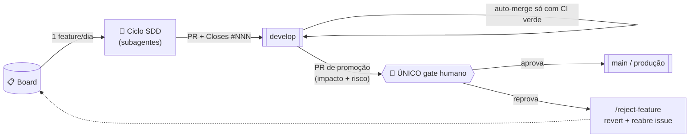
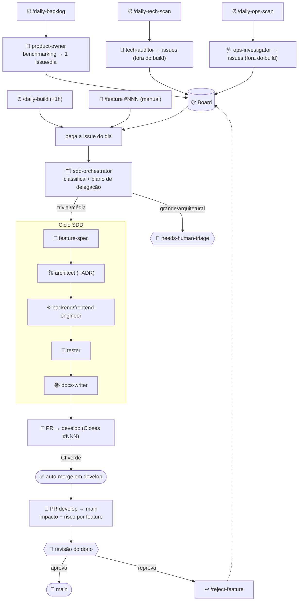

<div align="center">

# 🤖 ai-first

**Um método reutilizável para desenvolvimento de software conduzido por agentes de IA — com um único gate humano.**

*Spec-Driven Development + context mesh + ADRs + roster de subagentes + skills que dirigem o fluxo do backlog à produção. Mais liberal que "vibe coding", mais seguro que soltar a IA no repositório: a automação vai sozinha até `develop`; **a única aprovação humana é o PR de promoção para `main`**.*

</div>

---

## 📚 Sumário

- [O que é (e o que não é)](#-o-que-é-e-o-que-não-é)
- [A ideia central: um único gate humano](#-a-ideia-central-um-único-gate-humano)
- [Os cinco pilares](#-os-cinco-pilares)
- [O fluxo ponta a ponta](#-o-fluxo-ponta-a-ponta)
- [O ciclo SDD (por feature)](#-o-ciclo-sdd-por-feature)
- [O roster de subagentes](#-o-roster-de-subagentes)
- [As skills (o que dispara o quê)](#-as-skills-o-que-dispara-o-quê)
- [Governança e retroalimentação](#-governança-e-retroalimentação)
- [Context mesh leve (mapa de contexto)](#-context-mesh-leve-mapa-de-contexto)
- [As rotinas diárias autônomas](#-as-rotinas-diárias-autônomas)
- [Estrutura do repositório](#-estrutura-do-repositório)
- [Como adotar em um projeto](#-como-adotar-em-um-projeto)
- [FAQ](#-faq)

---

## 🎯 O que é (e o que não é)

`ai-first` é um **kit de método** — arquivos de processo, não uma biblioteca. Você o copia para um
projeto e ganha um jeito **disciplinado e majoritariamente autônomo** de a IA evoluir o produto: do
levantamento de backlog ao código mergeado, com rastreabilidade, invariantes garantidas e gates
automáticos.

|  | Vibe coding | **`ai-first`** | SDD manual |
|---|---|---|---|
| Especificação antes do código | ❌ | ✅ (rastreável) | ✅ |
| Invariantes garantidas | ❌ | ✅ (constituição + testes) | ✅ |
| Decisões duráveis registradas | ❌ | ✅ (ADRs) | 〜 |
| Velocidade de automação | ✅ | ✅ | ❌ (humano em todo passo) |
| Gate humano | nenhum | **um** (PR → `main`) | vários |

Ele **não** é: um framework de aplicação, uma dependência de runtime, ou algo acoplado a uma stack.
Os subagentes e skills são **stack-agnósticos** — eles leem as invariantes do *seu* projeto de três
arquivos (`docs/sdd/constitution.md`, `CLAUDE.md`, `docs/context-map.md`) e passam a falar a língua
do seu domínio.

## 🔑 A ideia central: um único gate humano

O objetivo é ser **mais liberal que o vibe code** sem abrir mão de controle. A automação:

1. **Descobre** o que fazer (Product Owner com benchmarking de mercado → 1 issue/dia no board).
2. **Implementa** cada issue pelo ciclo SDD (spec → plan → código → testes → docs).
3. **Auto-mergeia em `develop`** — mas **só com a CI verde**.
4. **Abre/atualiza** um PR de promoção `develop → main`, com o **impacto e o risco** de cada feature.

O humano entra **em um único ponto**: revisar esse PR `develop → main` e decidir o que chega à
produção — aprovar, ou reprovar (`/reject-feature`, que reverte e reabre a issue). Tudo antes disso é
autônomo e auditável.



## 🧱 Os cinco pilares

1. **SDD (Spec-Driven Development)** — toda mudança de comportamento começa por uma spec verificável
   e termina atualizando-a. `docs/sdd/`.
2. **Constituição** — princípios inegociáveis (P-1…P-N). Violar um é bug arquitetural, mesmo com
   testes verdes. `docs/sdd/constitution.md`.
3. **Context mesh leve** — um mapa determinístico (domínio → código+docs+ADRs+testes) que faz cada
   agente carregar **só** a fatia que a tarefa pede. `docs/context-map.md`.
4. **Retroalimentação** — **ADRs** (o *porquê* das decisões duráveis) e o **ledger de rejeições** (os
   "nãos" do dono) fazem cada feature decidir à luz das anteriores. `docs/adr/`, `docs/product/`.
5. **Roster de subagentes + skills** — papéis especializados mapeados às fases do SDD, e skills que os
   orquestram (uma feature, ou as rotinas diárias). `.claude/`.

## 🔄 O fluxo ponta a ponta



## 📐 O ciclo SDD (por feature)

Cada feature é uma **fatia vertical** rastreada numa pasta `docs/sdd/features/NNN-slug/`,
atravessando os módulos necessários — sem reorganizar o código por feature.

| Fase | Artefato | Quem |
|---|---|---|
| 1 · **SPECIFY** | `spec.md` (o quê/porquê, RFs, aceite, gate constitucional) | `feature-spec` |
| 2 · **PLAN** | `plan.md` (design, dados, idempotência, riscos) + ADR se durável | `architect` |
| 3 · **TASKS** | `tasks.md` (decomposição verificável, rastreada a RF/RNF) | `architect` |
| 4 · **IMPLEMENT** | código na branch `claude/<slug>` | `backend`/`frontend-engineer` |
| 5 · **VERIFY** | testes + evals; `typecheck`+`lint`+`test` verdes | `tester` |
| 6 · **DOCS** | spec e docs refletem o **entregue** | `docs-writer` |

> **Gate constitucional:** a spec não pode violar a constituição. Se precisar, a **primeira** mudança
> é um PR na própria constituição. Ver [`docs/sdd/README.md`](docs/sdd/README.md).

## 👥 O roster de subagentes

Papéis especializados em `.claude/agents/` — cada um carrega, pré-compilado, o subconjunto de
convenções da sua fase, para o thread principal delegar com **escopo curto** (contexto enxuto, menos
token). Detalhes em [`.claude/agents/README.md`](.claude/agents/README.md).

| Subagente | Papel |
|---|---|
| `product-owner` | Propõe features de negócio (benchmarking de mercado) e cria issues |
| `tech-auditor` | Varre bugs críticos + débito técnico → issues (não corrige) |
| `ops-investigator` | Varre métricas/logs/DLQ → issues com sugestão (não corrige) |
| `sdd-orchestrator` | Classifica o tamanho e devolve o plano de delegação (+ esforço por etapa) |
| `feature-spec` | Escreve a spec (o quê/porquê) |
| `architect` | Desenha o plano técnico + tasks + ADR |
| `ux-designer` | Brief de UI/UX (só em UI significativa) |
| `backend-engineer` | Implementa o código de produção |
| `frontend-engineer` | Implementa a interface |
| `tester` | Escreve os testes/evals e deixa o gate verde |
| `docs-writer` | Reflete o comportamento final nos docs |

> Um subagente **não** invoca outro — quem encadeia é o thread principal (a skill); o
> `sdd-orchestrator` **devolve o plano**, não spawna ninguém.

## 🛠 As skills (o que dispara o quê)

Skills em `.claude/skills/` rodam no thread principal e dirigem o roster.

| Skill | O que faz | Disparo |
|---|---|---|
| `/feature <n>` | Leva **uma issue** do board ao PR pelo ciclo SDD (com gates após spec e plan) | Humano |
| `/reject-feature <n>` | Reverte de `develop` uma feature reprovada, reabre a issue, registra o motivo | Humano |
| `/daily-backlog` | Cria **1 issue/dia** de negócio (Product Owner + benchmarking) | Cron 1 |
| `/daily-build` | Implementa a issue do dia, auto-mergeia em `develop`, abre o PR de promoção | Cron 2 (+1h) |
| `/daily-tech-scan` | Varre o **código** (bugs/débito) e cria issues fora do fluxo autônomo | Cron 3 |
| `/daily-ops-scan` | Varre o **runtime** (métricas/DLQ) e cria issues fora do fluxo autônomo | Cron 4 |
| `/new-extension` | Scaffold de um novo ponto de extensão pelo mecanismo canônico do projeto | Sob demanda |

## 🏛 Governança e retroalimentação

O que faz cada feature decidir **à luz das anteriores**, em vez de do zero:

- **Constituição** ([`docs/sdd/constitution.md`](docs/sdd/constitution.md)) — os princípios
  inegociáveis. Parte A universal (vem com o framework), Parte B do seu projeto.
- **ADRs** ([`docs/adr/`](docs/adr/)) — cada decisão arquitetural durável (contexto → decisão →
  alternativas → consequências → status). O `architect` **lê o índice antes de decidir** e **escreve o
  ADR**; ninguém re-litiga uma decisão viva em silêncio.
- **Ledger de rejeições** ([`docs/product/rejections.md`](docs/product/rejections.md)) — o par negativo
  dos ADRs: todo "não" do dono vira aprendizado, para o `product-owner` não repropor a mesma coisa.

## 🕸️ Context mesh leve (mapa de contexto)

[`docs/context-map.md`](docs/context-map.md) é a versão **determinística** de um *context mesh*: para
cada domínio, aponta código ⇄ docs ⇄ ADRs ⇄ features ⇄ testes. Uma sessão que vai mexer no domínio X
carrega **exatamente** aquela linha — em vez de reler a base ou adivinhar. Curadoria manual supera
retrieval semântico enquanto a base cabe num índice; se um dia não couber, o próprio mapa aponta o
caminho de indexar `docs/` + código e expor um tool de busca.

## ⏰ As rotinas diárias autônomas

Dois crons produzem a entrega do dia; dois auditam a saúde (sem implementar):

```
Cron 1 · /daily-backlog     → product-owner cria 1 issue de negócio (benchmarking)
   … ~1h (a issue assenta) …
Cron 2 · /daily-build       → implementa 1 feature → auto-merge em develop → PR de promoção → e-mail ao dono
Cron 3 · /daily-tech-scan   → tech-auditor cria issues de código (needs-human-triage)
Cron 4 · /daily-ops-scan    → ops-investigator cria issues de runtime (needs-human-triage)
```

- **Espace os crons pesados** (agênticos) por várias horas para não competirem por orçamento na mesma
  janela de uso do modelo. O `backlog` é leve e fica ~1h antes do build de propósito.
- **Toda rotina avisa em falha** (push + e-mail): se não conseguir criar issue, implementar ou
  auditar, encerra com um alerta de retry — **nunca em silêncio**.
- **`/daily-build` é checagem cruzada** do `/daily-backlog`: backlog vazio → alerta.

## 📁 Estrutura do repositório

```
ai-first/
├── README.md                      · este arquivo
├── CLAUDE.md                      · índice-mãe (mapa de módulos + invariantes) — preencha por projeto
├── .claude/
│   ├── agents/                    · o roster (11 subagentes + README)
│   └── skills/                    · feature, reject-feature, daily-*, new-extension
├── docs/
│   ├── sdd/
│   │   ├── constitution.md        · princípios inegociáveis (Parte A universal + Parte B do projeto)
│   │   ├── README.md              · o ciclo SDD
│   │   ├── specification.md       · RFs vivos (esqueleto)
│   │   ├── technical-plan.md      · RNFs / arquitetura macro (esqueleto)
│   │   ├── tasks.md               · backlog vivo (esqueleto)
│   │   ├── templates/             · spec / plan / tasks
│   │   └── features/              · uma pasta NNN-slug por feature (com um exemplo)
│   ├── adr/                       · README (índice) + template + ADR-0001 (adoção do método)
│   ├── context-map.md             · o context mesh leve
│   └── product/rejections.md      · ledger de rejeições
└── .github/
    ├── pull_request_template.md   · checklist + gate constitucional
    ├── ISSUE_TEMPLATE.md          · com as labels que o fluxo autônomo usa
    └── workflows/ci.yml           · o required check (typecheck + lint + test)
```

## 🚀 Como adotar em um projeto

1. **Copie** `.claude/`, `docs/` e `.github/` para o seu repositório (e o `CLAUDE.md` se ainda não
   tiver um).
2. **Preencha os três arquivos que dão voz ao framework:**
   - `docs/sdd/constitution.md` **Parte B** — as invariantes do seu domínio/stack (as universais P-1…P-10
     já vêm prontas).
   - `CLAUDE.md` — mapa de módulos, invariantes específicas e **pontos de extensão** do seu código.
   - `docs/context-map.md` — a tabela domínio → artefatos, com os caminhos reais.
3. **Adapte o gate de qualidade:** troque os comandos de `.github/workflows/ci.yml` pelos do seu
   ecossistema (o contrato é `typecheck` + `lint` + `test`, e `eval` se houver IA). Marque `ci` como
   **required check** em branch protection para `develop` e `main`, e crie a branch `develop`.
4. **Ajuste o mecanismo de extensão:** reescreva `.claude/skills/new-extension` com os contratos reais
   do seu projeto (ou crie irmãs — `new-provider`, `new-action`).
5. **Agende os crons** das rotinas diárias (na sua plataforma de agendamento), espaçados, com push +
   e-mail habilitados.
6. **Registre a adoção** — o `docs/adr/0001-adotar-metodo-ai-first.md` já documenta a decisão; ajuste-o
   ao seu contexto.

A partir daí: abasteça o board (ou deixe o `/daily-backlog` fazer), e o fluxo roda — com você
revisando apenas o PR `develop → main`.

## ❓ FAQ

**Isto substitui o programador?** Não. Substitui o *trabalho mecânico* de conduzir o ciclo. O humano
decide o que vai para produção (o gate) e resolve o que a automação marca como
`needs-human-triage` (mudanças grandes/arquiteturais, que **nunca** são auto-implementadas).

**E se a IA fizer besteira?** Três redes: a **CI verde** é obrigatória para o auto-merge; a **avaliação
de impacto/risco** destaca o que é sensível no PR de promoção; e o **gate humano** em `main` é a última
palavra. Reprovou? `/reject-feature` reverte com segurança (revert commit, sem reescrever histórico).

**Por que dois branches (`develop` e `main`)?** Para separar "pronto e testado" (autônomo) de
"publicado" (humano). `develop` acumula as entregas do dia; `main` só recebe o que o dono aprovou.

**Preciso usar as rotinas diárias?** Não. O `/feature <n>` manual dá todo o valor do SDD com gates em
cada etapa. As rotinas são a camada de **autonomia** por cima — ligue quando confiar no fluxo.

---

<div align="center">
<sub>Método <b>ai-first</b> — desenvolvimento conduzido por IA, com um único gate humano.</sub>
</div>
