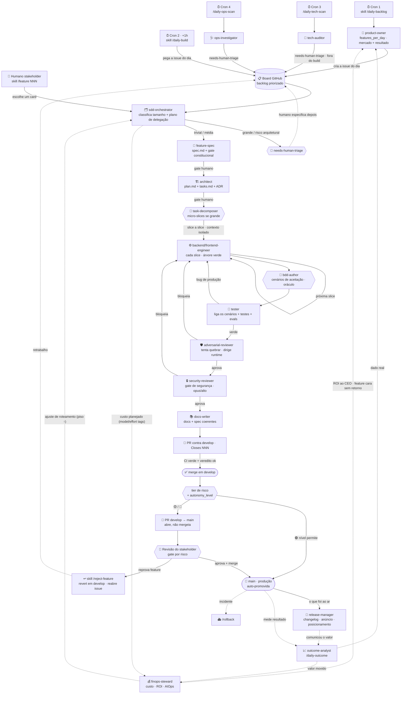

# 🤖 Subagentes (Claude Code) — o roster do método `ai-first`

Estes são **subagentes do Claude Code** (`agents/*.md`): ferramentas de
**desenvolvimento** que executam o ciclo SDD. Cada subagente carrega, pré-compilado, o
subconjunto de convenções da sua fase — assim o thread principal delega com um **escopo curto**
em vez de reexplicar as invariantes a cada turno. Isso mantém o contexto principal enxuto
(menos token) e o processo coeso.

> **Adapte ao seu projeto.** Estes subagentes são **stack-agnósticos**: eles buscam as
> invariantes do *seu* projeto em `docs/sdd/constitution.md`, `CLAUDE.md` e
> `docs/context-map.md`. Preencha esses três arquivos e o roster passa a falar a língua do seu
> domínio sem editar os agentes. Onde um agente cita um exemplo concreto (banco, fila, provedor),
> troque pelo seu — o **papel** de cada agente é o que importa.

## Roster mapeado ao ciclo SDD

**Modelo e esforço são roteados por etapa, não fixos.** O `sdd-orchestrator` avalia, por
custo-benefício, **qual modelo** (`haiku` · `sonnet` · `opus` · `fable`) e **qual esforço** (`baixo`
=low · `médio`=medium · `alto`=high · `extra`=xhigh) cada subagente deve usar em cada etapa — o mais
barato que faz o trabalho bem, reservando opus/extra para julgamento, risco e segurança. Ele **aplica
a tag** (`model:*`/`effort:*`) na issue e o driver (skill) invoca cada subagente com o modelo+esforço
indicados. **O `sdd-orchestrator` é o ÚNICO subagente com modelo fixo (opus, esforço alto)** — ele
decide o barato/caro dos outros, então precisa ser o mais forte para não errar o roteamento. A
verificação independente (`adversarial-reviewer`), o **gate de segurança (`security-reviewer`)** e
etapas que tocam invariante/segurança **nunca** descem abaixo de opus/alto, por mais que o
custo-benefício empurre para baixo.

| Subagente | Fase SDD | Entrega |
|---|---|---|
| `product-owner` | (backlog) | propõe features de negócio e **cria issues** no board (histórias e **épicos → histórias-filhas** via sub-issue; quantidade do diário ou sob demanda via `/backlog`) |
| `tech-auditor` | (saúde do código) | varre bugs críticos + débito técnico e **cria issues** (não corrige) |
| `ops-investigator` | (saúde de runtime) | investiga métricas/logs/DLQ e **cria issues** c/ sugestão (não corrige) |
| `migration-analyst` | 0 · CARACTERIZAÇÃO (brownfield) | lê a solução de ORIGEM (qualquer stack) e destila comportamento observável em spec de caracterização + mapa de migração — **só em migração/reescrita** (skill `/migrate`) |
| `sdd-orchestrator` | (entrada · **roteador**) | classifica tamanho; roteia **modelo+esforço** por etapa (custo-benefício); tag na issue. **Único de modelo fixo (opus/alto)** |
| `feature-spec` | 1 · SPECIFY | `docs/sdd/features/NNN-slug/spec.md` |
| `architect` | 2 · PLAN | `plan.md` + `tasks.md` (+ ADR se durável) |
| `task-decomposer` | 2½ · DECOMPOSE | quebra em micro-slices isoladas + slice de integração — **só se grande/complexa** |
| `ux-designer` | 3½ · DESIGN (UI) | brief de UI/UX — só em UI significativa |
| `backend-engineer` | 4 · IMPLEMENT | código na branch de feature |
| `frontend-engineer` | 4 · IMPLEMENT (UI) | implementa a UI — o brief do `ux-designer` ou tweaks diretos |
| `bdd-author` | 4¾ · ACCEPTANCE | critérios de aceite → cenários BDD executáveis (oráculo) — **se `bdd_style ≠ off`** |
| `tester` | 5 · VERIFY | liga os cenários ao runner + testes + evals; gate verde |
| `adversarial-reviewer` | 5½ · VERIFY (independente) | tenta QUEBRAR a mudança; dirige o runtime; veredito pode BLOQUEAR o merge |
| `security-reviewer` | 5¾ · VERIFY (segurança) | **executa o gate de segurança** (P-11): threat model do diff, authz/escopo, injeção, segredo/PII, dependência/CVE; veredito pode BLOQUEAR. Modelo fixo opus/alto (P-14) |
| `docs-writer` | 6 · DOCS | `docs/*`, `CLAUDE.md`, spec final coerente |
| `release-manager` | 6½ · RELEASE/GROWTH | a **porta de saída**: o que chegou a `main` vira valor percebido — changelog/release notes em linguagem de persona, rascunho de anúncio, posicionamento |
| `outcome-analyst` | (resultado) | mede se a feature entregou a métrica de sucesso (§8) com uso real |
| `finops-steward` | (economia · AIOps/FinOps) | mede o **custo** do pipeline (tokens/etapa, custo por feature mergeada, re-run do modelo barato, cache-hit) + runtime/cloud; cruza com o `outcome-analyst` (ROI) e **realimenta o roteamento** do `sdd-orchestrator`. Só mede/sugere |

## Diagrama de fluxo e interação



**gate\*** — no `/feature` **manual**, o fluxo PARA para aprovação humana após a `spec.md` e
após o `plan.md`. Na rotina `/daily-build` **autônoma**, esses gates são pulados; o gate humano é a
promoção `develop → main`, **por tier de risco** (P-10: no nível `conservador` o humano aprova tudo;
nos maiores, só 🟡/🔴 sobem — 🟢 auto-promove). Um subagente **não** invoca outro: quem encadeia é o
thread principal (a skill); o `sdd-orchestrator` **devolve o plano**.

## Fluxo típico (feature média)

```
sdd-orchestrator  → devolve o plano de delegação (roteia modelo+esforço)
  └─ feature-spec      (SPECIFY)   → spec.md
     └─ architect      (PLAN)      → plan.md + tasks.md (+ ADR se durável)
        └─ task-decomposer (DECOMPOSE, só se grande) → micro-slices + slice de integração
           └─ backend-engineer (IMPLEMENT) → slice a slice, cada uma em contexto ISOLADO
              └─ bdd-author  (ACCEPTANCE) → cenários executáveis dos critérios de aceite (oráculo)
                 └─ tester    (VERIFY)   → liga os cenários ao runner + testes por slice + integração
                    └─ adversarial-reviewer (VERIFY independente) → tenta quebrar o agregado
                       └─ security-reviewer (VERIFY segurança) → gate AppSec do diff (pode BLOQUEAR)
                          └─ docs-writer (DOCS) → docs coerentes
                             └─ (após promoção a main) release-manager → comunica o valor à persona
```

> **Decompor para não alucinar:** feature grande é fatiada em **micro-slices** pelo `task-decomposer`;
> cada slice é implementada numa **sessão de contexto limpa** (janela menor, menos alucinação, mais
> rápida), a **árvore fica verde a cada passo**, e a **slice de integração** agrega o valor da feature
> inteira, provável de ponta a ponta. Feature pequena não é decomposta (o `tasks.md` do `architect` basta).

> **Separação de papéis (P-13):** quem escreve (`backend-engineer`) **não** é quem aprova o risco. O
> `adversarial-reviewer` (correção) e o `security-reviewer` (segurança) — nenhum dos dois escreveu o
> código — podem **bloquear o auto-merge** de forma independente; e a promoção a produção é **por tier
> de risco** (P-10), não feature a feature.

> **A porta de saída (`release-manager`):** o ciclo não termina no merge. Depois que a feature chega a
> `main`, o `release-manager` traduz o que foi construído em **valor percebido** pela persona
> (changelog, anúncio, posicionamento) e o `outcome-analyst` mede se esse valor se realizou — um
> comunica, o outro afere. Sem a porta de saída, a squad constrói no vácuo.

- **Trivial** (1 arquivo, sem novo efeito/dado/proatividade): pule o SDD →
  `backend-engineer` → `tester`.
- **Grande / risco arquitetural** (novo módulo, nova porta, mudança de invariante):
  mesma cadeia, com **gate humano** após `feature-spec` e após `architect`.
- **Migração/reescrita** (trazer uma solução que já existe de outra base/stack): fluxo *brownfield* da
  skill `/migrate` (ver abaixo) — em vez de `feature-spec` **inventar** a spec, o `migration-analyst`
  **captura** o comportamento da origem como oráculo, e o resto do roster faz o port por equivalência.

## Fluxo brownfield (migração/reescrita) — skill `/migrate`

Quando o trabalho é trazer uma solução **já implementada** de outra base/stack (não uma feature nova),
o gargalo não é inventar o *o quê* — é **não perder o comportamento** que já existe. O fluxo troca a
fase de descoberta por uma de **caracterização** e usa **equivalência** como critério de aceite:

```
migration-analyst (CARACTERIZAÇÃO) → characterization.md (RF observáveis) + migration-map.md (origem→alvo)
  └─ sdd-orchestrator  → roteia modelo+esforço
     └─ architect      (PLAN do ALVO) → encaixe nos pontos de extensão + flag + plano de equivalência (+ADR)
        └─ task-decomposer (DECOMPOSE strangler-fig) → fatias na ordem do acoplamento, cada uma atrás de flag
           └─ backend/frontend-engineer (PORT) → fatia a fatia, contexto isolado, árvore verde, origem ainda servindo
              └─ tester (VERIFY por EQUIVALÊNCIA) → parallel-run/golden: alvo × origem, mesma entrada → mesma saída
                 └─ adversarial-reviewer → tenta quebrar a paridade; veredito pode BLOQUEAR
                    └─ docs-writer → caracterização vira spec viva do alvo; fecha ADRs; critério de desligar o legado
```

> **Strangler-fig, não big-bang** (ADR-0002): cada fatia migra **atrás de flag**, coexiste com a
> origem e só vira o tráfego quando a **equivalência** é provada — árvore verde a cada passo,
> reversível a qualquer momento. Prováveis defeitos do legado são **decisão humana no gate** (preservar
> ou corrigir → ADR), nunca conserto silencioso. Mesmo fluxo `feature → develop → main`, mesmos gates.

## Retroalimentação — o que faz cada feature decidir à luz das anteriores

- **ADRs** ([`docs/adr/`](adr/)) — cada decisão arquitetural durável (contexto →
  decisão → alternativas → consequências → status). O `architect` **lê o índice antes de
  decidir** e **escreve o ADR**; o `product-owner` consulta para não contradizer decisões
  vivas; o `docs-writer` mantém índice e status. O *porquê* das escolhas vira acervo cumulativo.
- **Ledger de rejeições** ([`docs/product/rejections.md`](product/rejections.md)) — o
  par negativo dos ADRs: toda feature reprovada pelo dono deixa o **motivo** e o **takeaway** (via
  `/reject-feature`). O `product-owner` **lê antes de propor**, então não repropõe um "não".
- **Mapa de contexto** ([`docs/context-map.md`](context-map.md)) — a versão *leve e
  determinística* de um context mesh: por domínio, aponta código ⇄ docs ⇄ ADRs ⇄ features ⇄
  testes. Cada subagente carrega **aquela** fatia em vez de reler a base.
- **Conhecimento** ([`docs/knowledge.md`](knowledge.md)) — o *saber-fazer* curado: **padrões** ("faça
  assim") e **anti-padrões** ("cuidado"). O `backend-engineer`/`architect` seguem os padrões; o
  `adversarial-reviewer` caça os anti-padrões; o `docs-writer` grava o idioma/bug novo ao fechar a
  feature (todo bug vira regressão **e** anti-padrão).
- **Evolução** ([`docs/evolution.md`](evolution.md)) — a *linha do tempo de aprendizados*: o que mudou e
  o que o uso real ensinou, costurando ADRs + rejeições + resultado numa narrativa única. Alimentada
  pelo `outcome-analyst` (`/daily-outcome`), pelo `docs-writer` e pelo `/reject-feature`; o
  `product-owner` lê para dobrar no que funcionou.
- **Loop de AIOps/custo** ([`docs/token-efficiency.md`](token-efficiency.md) §5) — o par econômico do
  resultado: o `finops-steward` mede o **custo** do pipeline e a **qualidade do roteamento** (re-run do
  modelo barato) e devolve um **ajuste de roteamento** ao `sdd-orchestrator` (sobe o piso onde o barato
  saiu caro) e o **ROI por feature** ao `product-owner`/CEO. O piso de segurança (P-14) nunca desce por
  esse loop. Derivações caras (market-scan, diff-digest, índice de repo) viram **artefato datado** (§6),
  lido em vez de re-derivado a cada feature.

## Vertical slice — na FEATURE, não no código

O código é organizado por **módulos/portas/adapters** (mapa em `CLAUDE.md`). O corte vertical
vive no nível da **feature**: cada `docs/sdd/features/NNN-slug/` é uma fatia rastreada
spec→plan→tasks→código→testes→docs **atravessando** os módulos necessários — uma issue, uma
branch, um `Closes #NNN`. Não reorganize o código por feature.

## Rotina diária autônoma (board → develop) — DOIS crons, ~1h de intervalo

```
Cron 1 · /daily-backlog
  └─ product-owner → BENCHMARKING de mercado + RESULTADO real → cria `features_per_day` issues
                     (a lacuna competitiva de maior valor; dedup + roadmap;
                     FALHA = alerta de retry push/e-mail)

        … ~1h de intervalo (as issues assentam no board) …

Cron 2 · /daily-build   ← start por CRON, não pelo stakeholder
  ├─ pega até `features_per_day` (po-suggested, trivial/média, sem needs-human-triage)
  ├─ implementa cada: /feature autônomo → PR contra develop
  ├─ VERIFICAÇÃO INDEPENDENTE: adversarial-reviewer tenta quebrar (pode BLOQUEAR)
  ├─ avalia IMPACTO + RISCO sobre o diff (/code-review): 🟢/🟡/🔴 → define o tier
  ├─ auto-merge em develop  (SÓ com CI verde + segurança + veredito não-bloqueante)
  ├─ promove develop → main POR TIER × autonomy_level (🟢 pode sozinha; 🟡/🔴 sobem)
  └─ resumo ao dono: o que foi ao ar, o que espera OK, perguntas em aberto
```

O gate humano é **por tier de risco** (não por feature): no nível `conservador` o humano aprova
tudo; nos maiores, 🟢 (e 🟡) auto-promovem e só o arriscado sobe. Mudança `grande`/arquitetural nunca
é auto-implementada — a rotina para e marca `needs-human-triage`. `[NEEDS CLARIFICATION]` bloqueante
vira pergunta assíncrona ao dono (`awaiting-human`), nunca chute.

### Cron 3 · /daily-tech-scan — saúde do código (só levanta, não corrige)

O `tech-auditor` varre o repositório em busca de **bugs críticos** e **débito técnico** e cria
issues — **sem implementar**. As issues levam `needs-human-triage` e **não** levam
`po-suggested`, então o `/daily-build` **nunca** as pega. **O humano dispara a correção** com
`/feature <n>` quando quiser.

### Cron 4 · /daily-ops-scan — saúde operacional/runtime (só levanta, não corrige)

Irmã do cron 3, mas olha o **runtime em produção** (métricas, logs, DLQ). O `ops-investigator`
cria issues com **evidência + sugestão de correção** — sem implementar, só leitura em produção.
Mesmo rótulo `needs-human-triage`, fora do fluxo autônomo.

### Cron 5 · /daily-outcome — fecha o loop com a realidade (mede, não corrige)

O `outcome-analyst` mede se as features **já promovidas** entregaram a **métrica de sucesso da spec
(§8)** com telemetria real (✅ moveu · 〜 cedo · ❌ não moveu). O que não moveu vira candidato a
iterar/remover e **alimenta o `product-owner`** com dado real — a retroalimentação mais valiosa.
Cadência menor (algumas vezes/semana — resultado leva dias para maturar).

### Espaçamento dos crons

Rode os crons **pesados** (agênticos) **espaçados** (várias horas) para não empilharem na mesma
janela de uso do modelo. O `backlog` é leve e fica ~1h antes do build de propósito (a issue
assenta no board antes do desenvolvimento começar).

### Resiliência — toda rotina avisa em falha (push + e-mail)

Cada rotina tem **contrato de falha/retry**: se não conseguir criar issue, auditar ou implementar
(erro de API, CI vermelha, merge bloqueado, backlog vazio, subagente falhou), **não termina em
silêncio** — encerra com um **alerta push/e-mail** dizendo o que falhou e a frase para
**re-disparar manualmente**. O `/daily-build` ainda serve de **checagem cruzada** do
`/daily-backlog` (backlog vazio → alerta).

## Como invocar

**Ideia do stakeholder → board:** `/feature-intake [ideia]` (skill `skills/feature-intake`) —
formata uma ideia crua do humano no **mesmo padrão de issue do `product-owner`** e a cria no board,
pronta para o fluxo. É a porta de entrada humana que espelha o que o PO produz por benchmarking.

**Backlog sob demanda (N de uma vez):** `/backlog [quantidade] [tema]` (skill `skills/backlog`) —
aciona o `product-owner` para escrever **quantas histórias/épicos o humano pedir** numa tacada, sem o
teto `features_per_day` do diário. Histórias soltas (fatias verticais) ou **épicos decompostos em
histórias-filhas** vinculadas por sub-issue do GitHub (a issue-mãe leva `epic` + `needs-human-triage`;
quem implementa são as filhas). Mesmo rigor de benchmarking, dedup, ledger e labels do `/daily-backlog`.

**Arranque imediato (logo após a gênese):** `/kickoff [quantidade]` (skill `skills/kickoff`) — liga o
desenvolvimento **na hora**, sem esperar o cron: semeia o backlog inicial pelo `product-owner` e
desenvolve até `parallelism` fatias **em paralelo** (contextos/worktrees isolados) pelo motor do
`/daily-build`, com **merge serializado** em `develop`. Exige o genoma armado. A própria gênese o
oferece no fim.

**Starter recomendado — a partir de uma issue do board:** `/feature <número-da-issue>` (skill
`skills/feature`). Roda no thread principal, lê a issue como requisito, cria a branch a
partir de `develop` e dirige a cadeia inteira até o PR contra `develop` (`Closes #NNN`), parando
nos gates após a spec e após o plan.

**Migração/reescrita (brownfield):** `/migrate <origem>` (skill `skills/migrate`). Traz uma solução
que já existe de outra base/stack, começando pela **caracterização** do comportamento da origem
(`migration-analyst`) e conduzindo o port por **equivalência**, fatia a fatia (strangler-fig), até o
PR contra `develop`. Ver ADR-0002.

**Reprovar no gate:** `/reject-feature <issue#> [motivo]` — reverte de `develop` (revert commit,
sem reescrever histórico) uma feature reprovada no PR `develop → main`, reabre a issue e registra
o motivo no ledger.

**Manual:** chame um subagente pelo nome via a ferramenta Agent (ex.: `architect` com o escopo da
feature). O `sdd-orchestrator` não spawna os outros; ele **devolve o plano** e o thread principal
executa cada etapa. Para trabalho independente, dispare subagentes em paralelo.
