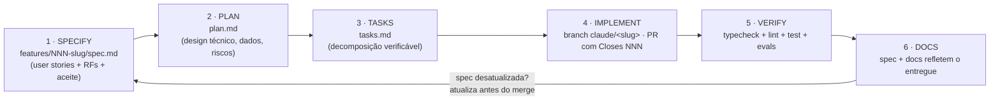

# 📐 SDD — Spec-Driven Development

Este diretório é o **kit de Spec-Driven Development** do método `ai-first`: a especificação
vem **antes** do código, o código é a implementação da especificação, e toda mudança de
comportamento **começa e termina** atualizando a spec.

> O SDD é o motor do fluxo autônomo: é o processo que um agente de IA segue para transformar
> uma **issue do board** em código mergeado, com rastreabilidade e gates — o que separa isto
> de "vibe coding" (pedir código solto e torcer). Ver o fluxo completo no
> [README raiz](../../README.md).

## 🗂 Estrutura

| Arquivo | Papel no ciclo SDD |
|---|---|
| [`constitution.md`](constitution.md) | **Constituição** — princípios e invariantes não-negociáveis. Toda spec nova é validada contra ela. |
| [`specification.md`](specification.md) | **Especificação funcional viva** — o *o quê*: personas, user stories e requisitos funcionais (RF-###) com aceite testável. |
| [`technical-plan.md`](technical-plan.md) | **Plano técnico** — o *como* macro: stack, dados, fluxos e requisitos não-funcionais (RNF-###). |
| [`tasks.md`](tasks.md) | **Backlog vivo** — candidatas mapeadas, rastreáveis a RF/RNF (matéria-prima do `product-owner`). |
| [`templates/`](templates/) | Templates de `spec` / `plan` / `tasks` para cada feature nova. |
| [`features/`](features/) | Uma pasta `NNN-slug/` por feature: `spec.md` + `plan.md` + `tasks.md` (a fatia vertical rastreada). |

## 🔁 O ciclo (para qualquer feature nova)

1. **Specify** — crie `spec.md` a partir de [`templates/spec-template.md`](templates/spec-template.md).
   Foque em **o quê / por quê** (nenhuma decisão de stack aqui). Incerteza vira
   `[NEEDS CLARIFICATION: pergunta]` — nunca chute regra de negócio.
2. **Gate constitucional** — a spec não pode violar a [constituição](constitution.md). Se
   precisar violar, a mudança é **antes** na constituição (PR próprio).
3. **Plan** — derive `plan.md`: módulos tocados, dados/migrations, portas/adapters,
   idempotência/falha, config/rollout, observabilidade, testes, riscos. Decisão **durável** vira
   [ADR](../adr/).
4. **Tasks / Decompose** — decomponha em tarefas pequenas e verificáveis (`tasks.md`), cada uma
   rastreável a um RF/RNF, na ordem das dependências. **Feature grande/complexa** vai além: o
   `task-decomposer` a fatia num **grafo de micro-slices** implementáveis em **contexto isolado**
   (janela menor, menos alucinação), com a **árvore verde a cada slice** e uma **slice de integração**
   que agrega o valor da feature inteira (`tasks-template.md` Forma B).
5. **Implement & verify** — branch de feature, PR com `Closes #NNN`; **slice a slice em contexto
   isolado** quando decomposta; `typecheck` + `lint` + `test` limpos **a cada slice**; critérios de
   aceite viram testes; comportamento de IA vira **eval**; verificação independente no agregado.
6. **Docs** — a `spec.md` termina refletindo o **comportamento implementado**, e os docs
   normativos afetados são atualizados.

## 📏 Convenções de identificadores

- `P-##` — princípio constitucional (imutável sem PR na constituição).
- `RF-DDD-##` — requisito funcional, agrupado por **domínio** (o prefixo `DDD` é seu; ex.:
  `AUTH`, `BILLING`, `AGT`…). Ver os domínios do seu projeto no [context-map](../context-map.md).
- `RNF-##` — requisito não-funcional (resiliência, segurança, custo, observabilidade).
- Critério de aceite sempre em **Dado / Quando / Então** e sempre **falseável**.

## 🔗 Relação com o resto da documentação

Os docs de referência descritivos (`architecture`, `data`, etc.) descrevem **como o sistema é
hoje**. O SDD adiciona a camada **normativa**: o que é **requisito** (quebrar = bug) versus o
que é só descrição do estado atual. O [`context-map`](../context-map.md) liga cada domínio ao
seu código + docs + ADRs + testes, para uma sessão carregar **só** o contexto que a tarefa
pede. Em conflito, vale a hierarquia da [constituição](constitution.md).
